# Kali Backup System - Architecture Diagrams

## Project Overview Mindmap

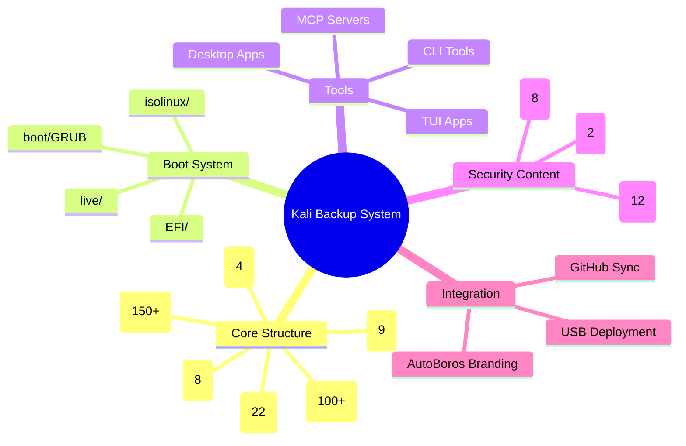

## Directory Structure

```mermaid
graph TD
    A[kali-backup-system] --> B[scripts/]
    A --> C[bibles/]
    A --> D[docs/]
    A --> E[agents/]
    A --> F[chains/]
    A --> G[mcp/]
    A --> H[tui/]
    A --> I[cli/]
    A --> J[desktop/]
    A --> K[config/]
    A --> L[skills/]
    
    C --> M[red-team]
    C --> N[blue-team]
    C --> O[general]
    
    M --> M1[web-pentesting]
    M --> M2[network-exploitation]
    M --> M3[password-attacks]
    M --> M4[wireless-hacking]
    M --> M5[social-engineering]
    M --> M6[physical-security]
    M --> M7[privilege-escalation]
    M --> M8[post-exploitation]
    M --> M9[reverse-engineering]
    M --> M10[cloud-pentesting]
    M --> M11[osint]
    M --> M12[phishing-campaigns]
    
    N --> N1[incident-response]
    N --> N2[forensics]
    N --> N3[malware-analysis]
    N --> N4[log-analysis]
    N --> N5[network-monitoring]
    N --> N6[siem-analysis]
    N --> N7[threat-hunting]
    N --> N8[vulnerability-management]
    
    O --> O1[hardware-arsenal]
    O --> O2[personal-botnet-c2]
```

## Scripts Flow

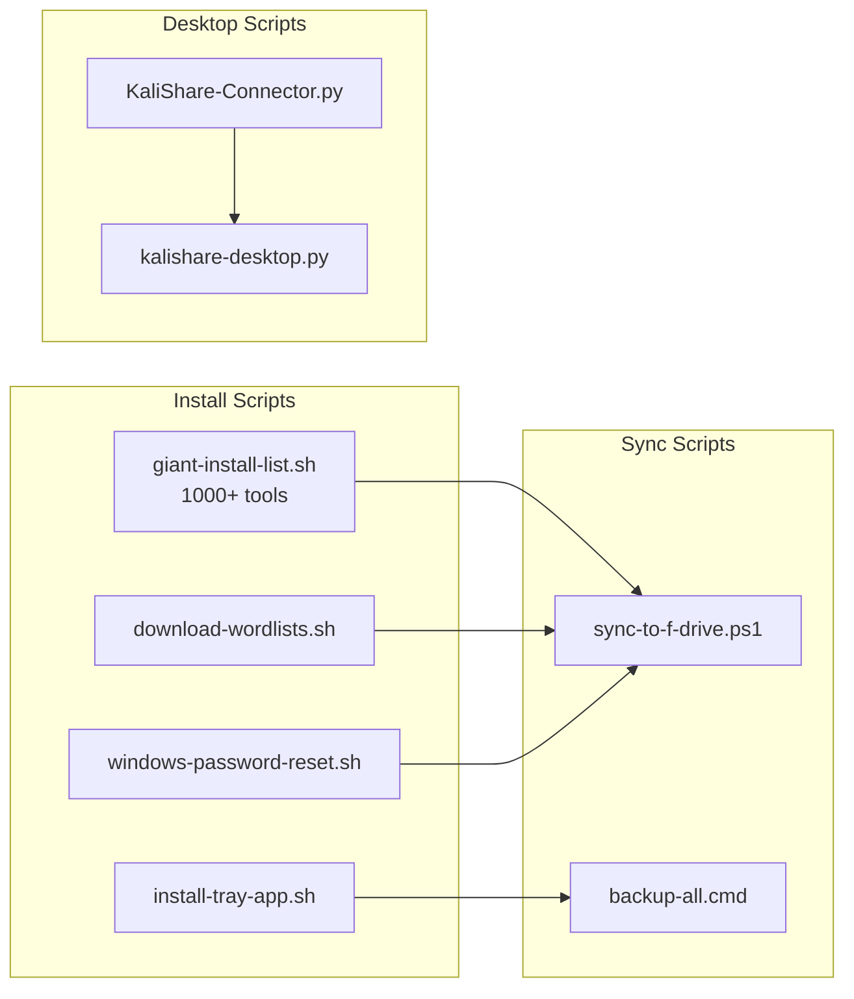

## MCP Integration

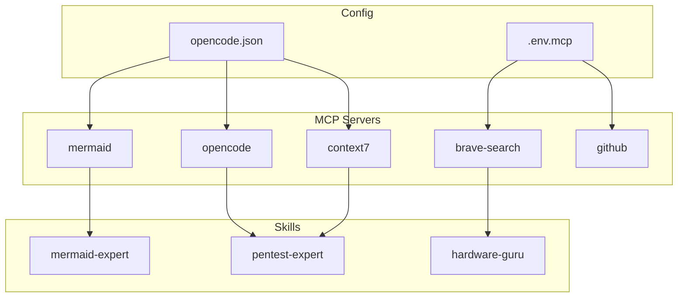

## GitHub Sync Flow

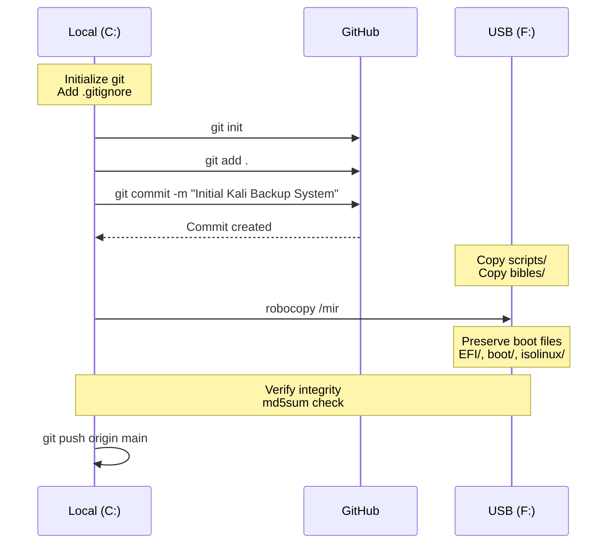

## Agent System

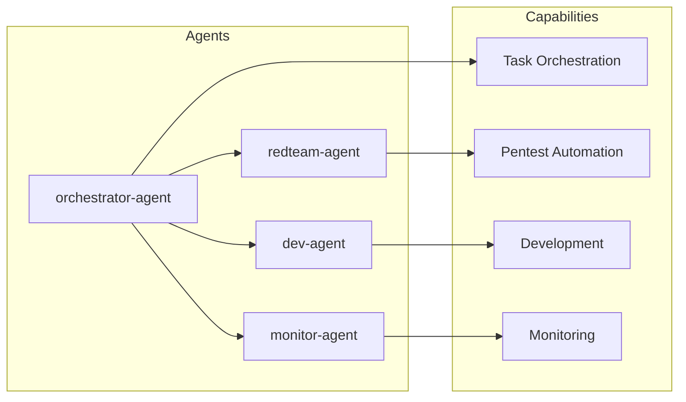

## Chains (Automation Workflows)

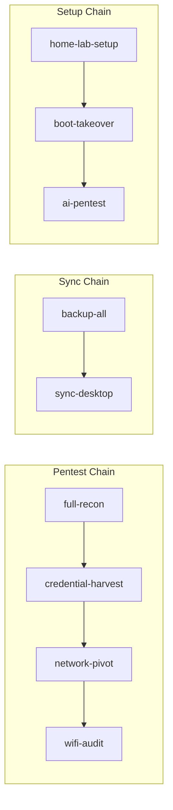

## Boot System (Kali Live)

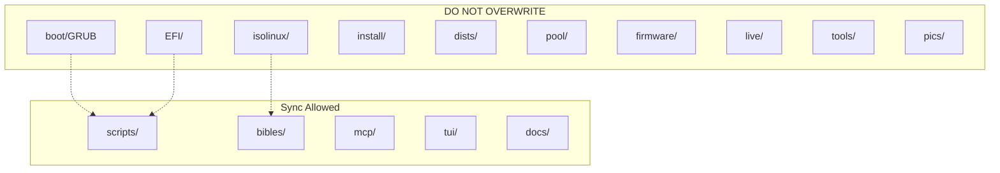

## Branding (AutoBoros + Kali)

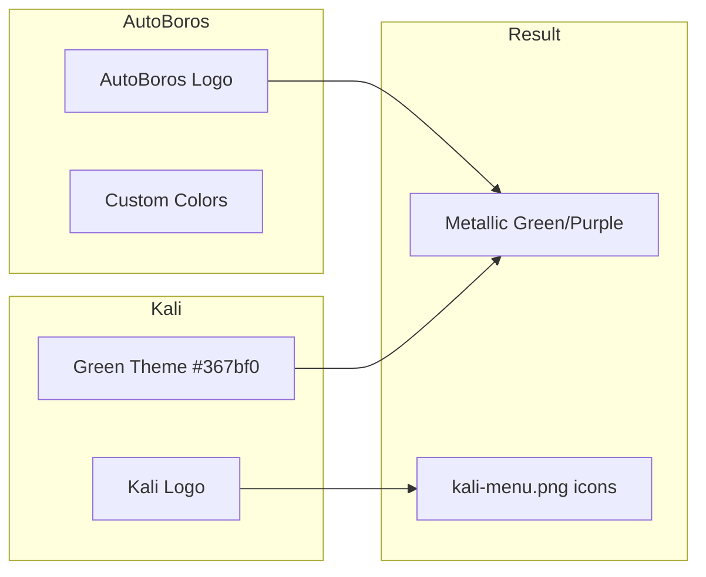

## Hardware Arsenal

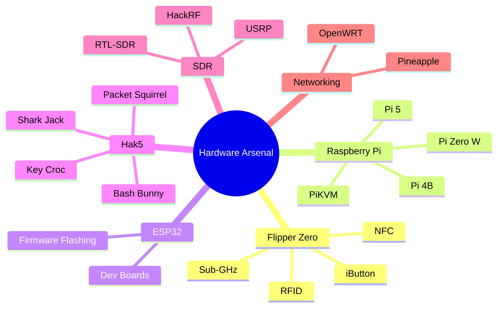

## Personal C2/Botnet

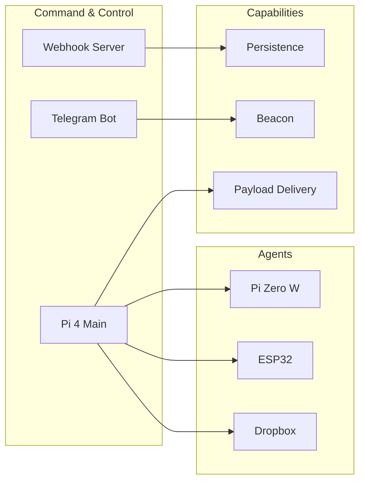